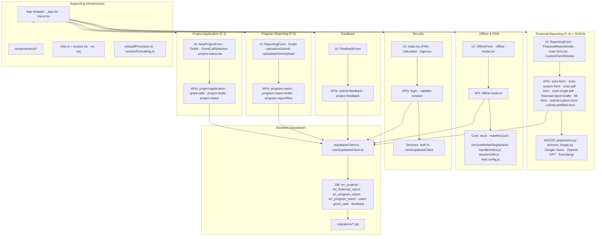

# Sudan ERR Chatbot - System Architecture

## Overview

The Sudan ERR (Emergency Response Rooms) Chatbot is a Next.js Progressive Web Application designed for humanitarian aid management in Sudan. It implements the F-System framework for managing Group Cash Transfers and community interventions.

## System Architecture Flowchart

## Architecture Components

### 🏗️ Project Application (F-1)
**Purpose:** Manage project applications and grant requests following the F-System framework.

**Key Files:**
- **UI Components:**
  - `components/forms/NewProjectForm/NewProjectForm.tsx` - Main application form
  - `components/forms/NewProjectForm/ProjectDrafts.tsx` - Draft management
  - `components/forms/NewProjectForm/GrantCallSelection.tsx` - Grant selection
  - `pages/project-status.tsx` - Project status viewing

- **API Endpoints:**
  - `pages/api/project-application.ts` - Main CRUD operations
  - `pages/api/grant-calls.ts` - Available funding opportunities
  - `pages/api/project-drafts.ts` - Draft management
  - `pages/api/project-status.ts` - Status tracking

**Workflow:** Grant Selection → Form Filling → Draft Saving → Submission → Status Tracking

---

### 💰 Financial Reporting (F-4) + OCR/AI
**Purpose:** Process financial reports with AI-powered document scanning and OCR.

**Key Files:**
- **UI Components:**
  - `components/forms/ReportForm/ReportingForm.tsx` - Financial report form
  - `components/forms/ReportForm/FinancialReportDrafts.tsx` - Draft management
  - `pages/scan-form.tsx` - Document scanning interface
  - `components/forms/CustomFormReview.tsx` - OCR result review

- **API Endpoints:**
  - `pages/api/scan-form.ts` - Main OCR processing
  - `pages/api/scan-custom-form.ts` - Custom form OCR
  - `pages/api/scan-pdf-form.ts` - PDF-specific processing
  - `pages/api/scan-single-pdf.ts` - Single PDF processing
  - `pages/api/financial-report-drafts.ts` - Draft management
  - `pages/api/fill-form.ts` - Manual form submission
  - `pages/api/submit-custom-form.ts` - Custom form submission
  - `pages/api/submit-prefilled-form.ts` - Prefilled form submission

- **AI/OCR Pipeline:**
  - `preprocess.py` - Image preprocessing (Python)
  - `process_image.py` - Image processing (Python)
  - Google Cloud Vision API - OCR processing
  - OpenAI GPT-3.5-turbo - Structured data extraction
  - `franc` library - Language detection (Arabic/English)

**Processing Flow:** Image Upload → Preprocessing → OCR → AI Classification → Data Validation → Database Storage

---

### 📊 Program Reporting (F-5)
**Purpose:** Track program activities, reach data, and outcomes.

**Key Files:**
- **UI Components:**
  - `components/forms/ProgramReportForm/ReportingForm.tsx` - Program report form
  - `components/forms/ProgramReportForm/ProgramReportDrafts.tsx` - Draft management
  - `components/forms/ProgramReportForm/upload/onSubmit.ts` - Form submission
  - `components/forms/ProgramReportForm/upload/performUpload.ts` - File upload

- **API Endpoints:**
  - `pages/api/program-report.ts` - Main submission endpoint
  - `pages/api/program-report-drafts.ts` - Draft management
  - `pages/api/program-report/files.ts` - File upload handling

**Features:** Activity tracking, demographic reach data, lessons learned, file attachments

---

### 💬 Feedback
**Purpose:** Collect user feedback for app improvement and project-specific feedback.

**Key Files:**
- **UI Components:**
  - `components/forms/FeedbackForm.tsx` - Feedback form interface

- **API Endpoints:**
  - `pages/api/submit-feedback.ts` - App feedback submission
  - `pages/api/project-feedback.ts` - Project-specific feedback

**Types:** Usability ratings, challenges, recommendations, project feedback

---

### 📱 Offline & PWA
**Purpose:** Enable offline functionality and Progressive Web App capabilities.

**Key Files:**
- **UI Components:**
  - `components/forms/OfflineForm.tsx` - Offline form interface
  - `pages/offline-mode.tsx` - Offline mode page

- **API Endpoints:**
  - `pages/api/offline-mode.ts` - Offline submission handling

- **Core Infrastructure:**
  - `public/sw.js` - Service worker for caching
  - `public/manifest.json` - PWA manifest
  - `services/serviceWorkerRegistration.js` - SW registration
  - `services/handleOnline.js` - Online/offline event handling
  - `services/sessionUtils.js` - Session and queue management
  - `next.config.js` - PWA configuration

**Features:** Asset caching, offline form queue, automatic sync, network detection

---

### 🔐 Security
**Purpose:** Implement multi-layer security for sensitive humanitarian data.

**Key Files:**
- **UI Components:**
  - `pages/index.tsx` - PIN-protected entry point
  - `components/calculator/Calculator.tsx` - Calculator disguise
  - `pages/login.tsx` - Authentication interface

- **API Endpoints:**
  - `pages/api/login.ts` - Authentication endpoint
  - `pages/api/validate-session.ts` - Session validation

- **Services:**
  - `services/auth.ts` - JWT token management
  - `services/newSupabaseClient.ts` - Enhanced Supabase client

**Security Layers:**
1. **PIN Protection** - Calculator interface disguise
2. **Session Management** - JWT tokens + Supabase Auth
3. **Role-based Access** - User roles and status validation
4. **API Protection** - Authorization headers on all endpoints
5. **Secure Storage** - Proper session handling

---

### 🗄️ Backend (Supabase)
**Purpose:** Database and backend services using Supabase PostgreSQL.

**Key Files:**
- **Client Configuration:**
  - `services/supabaseClient.ts` - Basic Supabase client
  - `services/newSupabaseClient.ts` - Enhanced client with auth config

- **Database Schema:**
  - `supabase/migrations/20250227113005_create_zeko_tables.sql` - Main schema

**Database Tables:**
- `err_projects` - Project applications (F-1, F-2, F-3)
- `err_financial_report` - Financial reports (F-4)
- `err_program_report` - Program reports (F-5)
- `err_program_reach` - Activity reach data
- `users` - User management and roles
- `grant_calls` - Available funding opportunities
- `app_feedback` - Application feedback
- `project_feedback` - Project-specific feedback

**Integration Features:**
- Supabase Auth for authentication
- Real-time data synchronization
- File storage via Supabase Storage
- Row Level Security (RLS) policies
- Database triggers and functions

---

### 🌐 Supporting Infrastructure
**Purpose:** Core application infrastructure and utilities.

**Key Files:**
- **App Core:**
  - `pages/_app.tsx` - App wrapper with i18n and service worker
  - `pages/menu.tsx` - Central navigation hub

- **UI Components:**
  - `components/ui/*` - Reusable UI components (Button, Card, Input, etc.)

- **Internationalization:**
  - `services/i18n.ts` - i18n configuration
  - `public/locales/*/` - Translation files (Arabic, English, Spanish)

- **Utilities:**
  - `utils/pdfProcessor.ts` - PDF processing utilities
  - `utils/numberFormatting.ts` - Number formatting helpers

## Data Flow

1. **Authentication Flow:** PIN Entry → Calculator → Login → Session Validation → Menu Access
2. **Project Application:** Grant Selection → Form Filling → Draft Saving → Submission → Status Tracking
3. **Financial Reporting:** Document Upload → OCR Processing → AI Classification → Data Validation → Database Storage
4. **Program Reporting:** Activity Entry → Reach Data → File Upload → Submission → Database Storage
5. **Offline Processing:** Form Submission → Local Queue → Network Detection → Automatic Sync

## Technology Stack

- **Frontend:** Next.js, React, TypeScript, Tailwind CSS
- **Backend:** Next.js API Routes, Supabase PostgreSQL
- **AI/ML:** Google Cloud Vision API, OpenAI GPT-3.5-turbo, Python preprocessing
- **PWA:** Service Workers, Web App Manifest, Offline-first architecture
- **Security:** JWT tokens, Supabase Auth, Role-based access control
- **Internationalization:** i18next, Arabic/English/Spanish support

## Key Features

- **F-System Implementation:** Complete workflow for humanitarian aid management
- **AI-Powered OCR:** Handwritten Arabic and English document processing
- **Offline Capability:** Full functionality without internet connection
- **Multi-language Support:** Arabic (primary), English, Spanish
- **Security by Design:** PIN protection, session management, role-based access
- **Progressive Web App:** Installable, offline-capable, mobile-optimized
- **Real-time Sync:** Automatic data synchronization when online

This architecture provides a robust, secure, and user-friendly platform specifically designed for humanitarian aid operations in challenging environments like Sudan.
